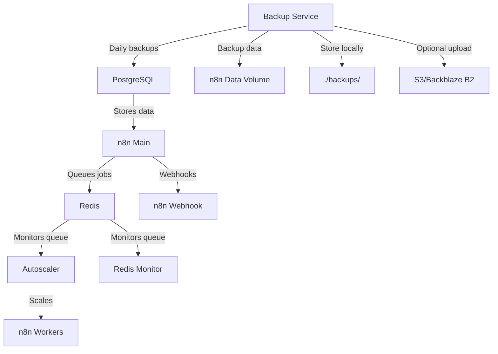

# n8n Autoscaling System with Automated Backups

> **Fork of [conor-is-my-name/n8n-autoscaling](https://github.com/conor-is-my-name/n8n-autoscaling)** with enhanced backup capabilities.

NOTE: If you want to use Cloudflared please check the 2nd branch for a more secure installation configuration. https://github.com/conor-is-my-name/n8n-autoscaling/tree/feature/cloudflared

A Docker-based autoscaling solution for n8n workflow automation platform. Dynamically scales worker containers based on Redis queue length.  No need to deal with k8s or any other container scaling provider, a simple script runs it all and is easily configurable.

## 🆕 Enhanced Features in this Fork

- **Automated Daily Backups**: PostgreSQL dumps + n8n data volume backups
- **Intelligent Retention**: Keep 14 local copies with automatic cleanup
- **Offsite Storage**: Optional encrypted uploads to S3/Backblaze B2 via restic
- **Simple Restore**: One-command restore process with interactive prompts
- **Production Ready**: Comprehensive backup solution in the `backup/` folder

Tested with hundreds of simultaneous executions running on a 8 core 16gb ram VPS.  

Includes Puppeteer and Chrome built-in for pro level scraping from the n8n code node, works better than the community nodes.  

Simple install, just clone the files + docker compose up

## Architecture Overview



## Features

- Dynamic scaling of n8n worker containers based on queue length
- Configurable scaling thresholds and limits
- Redis queue monitoring
- Docker Compose-based deployment
- Health checks for all services
- **🆕 Automated daily backups** (PostgreSQL + n8n data)
- **🆕 Intelligent backup retention** (14 local copies)
- **🆕 Optional offsite storage** (S3/Backblaze B2 via restic)
- **🆕 One-command restore process**

## Prerequisites

- Docker and Docker Compose
- If you are a new user, I recommend either docker desktop or using the docker convenience script for ubuntu.  

## Quick Start

1. Clone this enhanced repository:
   ```bash
   git clone https://github.com/ductridev/n8n-autoscaling.git
   cd n8n-autoscaling
   ```
2. Rename .env.example to .env
3. Configure your environment variables in the .env file - defaults are good to go, but set new passwords and tokens.
4. Create backup directory:
   ```bash
   mkdir -p ./backups
   ```
5. Run:
   ```bash
   docker network create shark
   ```
6. Run:
   ```bash
   docker compose up -d
   ```

The backup service will automatically start and create daily backups in `./backups/`.

We create the shark external network in step 4 to make it easier to plug in other containers later.  If you don't want to do this, you can comment out the shark network in the docker compose file.  

## Configuration

- Make sure you set your own passwords and encryption keys in the .env file!!!
- By default each worker handles 10 tasks at a time, you can modify this in the docker-compose under:      
   - N8N_CONCURRENCY_PRODUCTION_LIMIT=10
- Adjust these to be greater than your longest expected workflow execution time measured in seconds:
   - N8N_QUEUE_BULL_GRACEFULSHUTDOWNTIMEOUT=300
   - N8N_GRACEFUL_SHUTDOWN_TIMEOUT=300

### Key Environment Variables

| Variable | Description | Default |
|----------|-------------|---------|
| `MIN_REPLICAS` | Minimum number of worker containers | 1 |
| `MAX_REPLICAS` | Maximum number of worker containers | 5 |
| `SCALE_UP_QUEUE_THRESHOLD` | Queue length to trigger scale up | 5 |
| `SCALE_DOWN_QUEUE_THRESHOLD` | Queue length to trigger scale down | 2 |
| `POLLING_INTERVAL_SECONDS` | How often to check queue length | 30 |
| `COOLDOWN_PERIOD_SECONDS` | Time between scaling actions | 180 |
| `QUEUE_NAME_PREFIX` | Redis queue prefix | `bull` |
| `QUEUE_NAME` | Redis queue name | `jobs` |

### n8n Configuration

Ensure these n8n environment variables are set:
- `EXECUTIONS_MODE=queue`
- `QUEUE_BULL_REDIS_HOST=redis`
- `QUEUE_HEALTH_CHECK_ACTIVE=true`

### 🆕 Backup Configuration

Additional backup environment variables in `.env`:

| Variable | Description | Default |
|----------|-------------|---------|
| `BACKUP_KEEP` | Number of local backups to retain | 14 |
| `BACKUP_SLEEP_SECONDS` | Backup interval in seconds | 86400 (24h) |
| `RESTIC_ENABLED` | Enable offsite backups | false |
| `RESTIC_REPOSITORY` | Restic repository URL | - |
| `RESTIC_PASSWORD` | Encryption password | - |
| `AWS_ACCESS_KEY_ID` | S3 access key (if using S3) | - |
| `AWS_SECRET_ACCESS_KEY` | S3 secret key (if using S3) | - |
| `B2_ACCOUNT_ID` | Backblaze account ID (if using B2) | - |
| `B2_ACCOUNT_KEY` | Backblaze account key (if using B2) | - |

See `backup/README.md` for detailed setup instructions.

## Scaling Behavior

The autoscaler:
1. Monitors Redis queue length every `POLLING_INTERVAL_SECONDS`
2. Scales up when:
   - Queue length > `SCALE_UP_QUEUE_THRESHOLD`
   - Current replicas < `MAX_REPLICAS`
3. Scales down when:
   - Queue length < `SCALE_DOWN_QUEUE_THRESHOLD`
   - Current replicas > `MIN_REPLICAS`
4. Respects cooldown period between scaling actions

## Monitoring

The system includes:
- Redis queue monitor service (`redis-monitor`)
- Docker health checks for all services
- Detailed logging from autoscaler
- **🆕 Backup service monitoring** (`n8n-backup`)

## 🆕 Backup & Restore

### Automated Backups
- **Daily automated backups** of PostgreSQL database and n8n data volume
- **Local retention**: Keeps 14 copies, automatically deletes older ones
- **Timestamped archives**: `n8n-backup-YYYYMMDDTHHMMSSZ.tar.gz`
- **Optional offsite storage**: Encrypted uploads to S3/Backblaze B2

### Manual Backup
```bash
# Test backup system
docker compose run --rm n8n-backup /usr/local/bin/backup.sh

# Check backup files
ls -la ./backups/
```

### Simple Restore Process
```bash
# 1. Stop services
docker compose stop

# 2. Restore from backup
docker compose run --rm n8n-backup /usr/local/bin/restore.sh /backups/n8n-backup-TIMESTAMP.tar.gz

# 3. Start services
docker compose up -d
```

For detailed backup configuration and offsite storage setup, see [`backup/README.md`](backup/README.md).

## Troubleshooting

- Check container logs: `docker-compose logs [service]`
- Verify Redis connection: `docker-compose exec redis redis-cli ping`
- Check queue length manually: `docker-compose exec redis redis-cli LLEN bull:jobs:wait`

Webhook URL example:
Webhooks use your docker service name not local host, example:
http://n8n-webhook:5678/webhook/d7e73b77-6cfb-4add-b454-41e4c91461d8

## Contributing

This is a fork of the original [n8n-autoscaling](https://github.com/conor-is-my-name/n8n-autoscaling) project with enhanced backup capabilities. 

**Backup improvements include:**
- Complete automated backup solution in `backup/` folder
- PostgreSQL + n8n data volume backups
- Intelligent retention policies
- Optional encrypted offsite storage via restic
- One-command restore process
- Production-ready deployment

## License

MIT License - See [LICENSE](LICENSE) for details.
